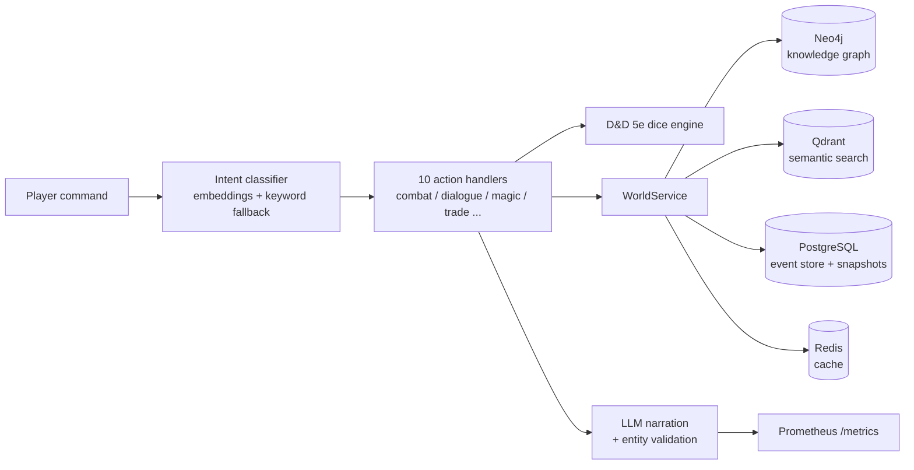

# Game Master V3

**An AI game master with a persistent, consistent world** — polyglot persistence (Neo4j + Qdrant + PostgreSQL + Redis) behind an async FastAPI backend, with event sourcing, snapshot rollback via reverse event replay, procedural world generation, and D&D 5e mechanics.

[](https://github.com/Galiusbro/Game-master-v3/actions/workflows/ci.yml)
[](pyproject.toml)
[](src/tests)
[](LICENSE)

Players type natural language ("attack the innkeeper with my axe"); the system classifies intent, resolves it through real D&D 5e dice mechanics, mutates a persistent world across four data stores, logs every change to an event store, and narrates the outcome with an LLM — with a validation pass that flags entities the LLM invented.

## Architecture

Every mutation flows through one service and lands in all the right stores:



- **Neo4j** holds the knowledge graph: entities and their relationships, traversed for context.
- **Qdrant** powers semantic entity resolution ("the grumpy innkeeper" → the right NPC).
- **PostgreSQL** is the event store: every change is appended with before/after state and rollback data.
- **Redis** caches entities, searches, and AI responses with per-type TTLs.

## Event sourcing with real rollback

Every entity mutation is logged with its inverse. Rolling back to a snapshot replays the event log in reverse — creates are deleted, updates restored, deletes re-created — across the graph and vector stores, with a per-event error report:

```bash
curl -X POST localhost:8000/api/v1/snapshots/{snapshot_id}/rollback
# → {"message": "Rollback completed",
#    "report": {"events_seen": 12, "reverted_creates": 3,
#               "reverted_updates": 7, "restored_deletes": 1,
#               "skipped": 1, "errors": []}}
```

The replay is covered by 8 dedicated unit tests (reverse ordering, best-effort error handling, system-event skipping).

## Procedural world generation

`src/core/worldgen/` (17 modules) builds a world from a seed: fractal-noise heightmap → continents and seas → rivers → regions and biomes → settlements, roads and politics → NPCs and bosses → optional LLM enrichment of names, lore, and relationships. A generated sample ships in [`world_exports/sample_world.json`](world_exports/).

```bash
curl -X POST localhost:8000/api/v1/world/generate -d '{"seed": "demo"}' -H "Content-Type: application/json"
```

## Honest notes on the AI layer

- **Entity validation, not magic:** LLM output is checked against the context entities served to the prompt; unknown proper nouns flag the response (`hallucination_detected`), lower its confidence, and increment a Prometheus counter. It is a heuristic consistency check — enforcement (regeneration on failure) is on the roadmap.
- **Degrades without a key:** no `OPENAI_API_KEY` → the app boots and plays with deterministic fallback narration; dice mechanics and world state work fully.
- **Observability:** request metrics via instrumentator + custom AI metrics (tokens, confidence, hallucination rate) at `/metrics`; a Grafana dashboard example lives in `docker/grafana/`.

## Quick start

```bash
git clone https://github.com/Galiusbro/Game-master-v3.git && cd Game-master-v3
cp .env.example .env          # add OPENAI_API_KEY for LLM narration (optional)

make start                    # docker compose: Neo4j, Qdrant, Postgres, Redis, Prometheus, Grafana
make init                     # schema + demo world
make dev                      # FastAPI on :8000
```

Play from the terminal:

```bash
curl -X POST localhost:8000/api/v1/game/command \
  -H "Content-Type: application/json" \
  -d '{"player_id": "...", "command": "talk to the innkeeper about the old ruins"}'
```

Interactive docs: `localhost:8000/docs` (37 endpoints: entity CRUD, semantic search, game commands, streaming SSE, snapshots/rollback, world generation).

## Development

```bash
pytest src/tests -q            # 108 tests, no live services needed (fully mocked)
mypy src config                # strict config, 0 errors
make test-coverage
```

The test suite runs without any of the four databases — infrastructure clients are mocked at the module boundary, which is also how CI runs.

## Project layout

```
src/
  api/            routes + 10 natural-language action handlers
  core/           world service, event sourcing, dice engine, semantic parser, worldgen/
  domain/         typed Pydantic entities (Player, NPC, Location, Item, Quest, ...)
  infrastructure/ neo4j / qdrant / redis / openai clients, intent classifier
  monitoring/     Prometheus metrics
  tests/          108 unit/API tests (mock-based)
examples/         runnable demo scripts (live stack required)
docker/           full local stack incl. Prometheus + Grafana
```

## Roadmap

- [ ] Enforcement mode for entity validation (regenerate on hallucination)
- [ ] Scheduled snapshots + retention
- [ ] Multi-provider LLM (Anthropic / local) behind the narration interface
- [ ] Wire the remaining DB-level metrics into Grafana
- [ ] RAG docs search: store chunk text in payloads

## License

MIT
